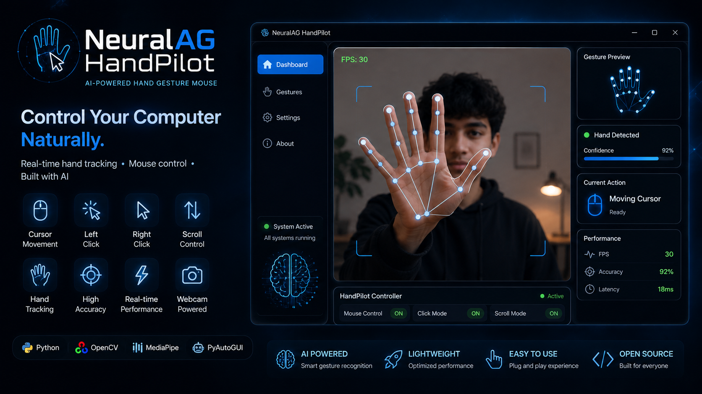

# 🖐️ NeuralAG HandPilot

<p align="center">
  
</p>

<h3 align="center">
AI-Powered Virtual Mouse Controlled Using Hand Gestures
</h3>

---

## 🚀 About NeuralAG HandPilot

**NeuralAG HandPilot** is an AI-powered virtual mouse system that allows users to control their computer using only natural hand gestures.

Using a standard webcam, NeuralAG HandPilot tracks your hand movements in real-time and converts your gestures into computer actions like cursor movement, clicking, double-clicking, and dragging.

No physical mouse is required.

Your hand becomes the controller. 🖐️

---

## ✨ Features

✅ Real-time AI hand tracking  
✅ Webcam-based mouse control  
✅ Smooth cursor movement  
✅ Gesture-based clicking  
✅ Gesture-based double-clicking  
✅ Gesture-based drag mode  
✅ Lightweight and fast performance  
✅ No additional hardware required  
✅ Simple one-click launcher  

---

# 🧠 How It Works

NeuralAG HandPilot uses computer vision and AI hand tracking to understand your movements.

The system works using this pipeline:


📷 Webcam
↓
🧠 MediaPipe Hand Detection
↓
✋ Gesture Recognition System
↓
🖱️ Virtual Mouse Controller
↓
💻 Computer Interaction


The camera detects your hand.

The AI system identifies finger positions and gestures.

The gesture engine converts those movements into mouse commands.

---

# ✋ Gesture Controls

NeuralAG HandPilot currently supports four main gestures.

---

# ☝️ 1. Cursor Control

### Gesture:


☝️ Index Finger Movement


### How to use:

Move your index finger naturally in front of the camera.

### Action:

🖱️ Controls the mouse cursor.

The cursor follows your index finger movement on the screen.

Used for:

- Moving around the desktop
- Selecting items
- Navigating applications

---

# 👌 2. Click

### Gesture:


👌 Thumb + Index Finger Pinch


### How to use:

Bring your thumb and index finger together.

### Action:

🖱️ Performs a left mouse click.

Used for:

- Opening buttons
- Selecting files
- Clicking applications

---

# ✌️ 3. Double Click

### Gesture:


✌️ Two Finger Gesture


### How to use:

Show two fingers to the camera.

### Action:

🖱️ Performs a double click.

Used for:

- Opening folders
- Launching applications
- Opening files

---

# 👊 4. Drag Mode

### Gesture:


👊 Closed Fist


### How to use:

Make a closed fist and move your hand.

### Action:

🖱️ Enables drag control.

Used for:

- Dragging files
- Moving objects
- Selecting and repositioning items

---

# 📋 Gesture Summary

| Gesture | Emoji | Action |
|---|---|---|
| Index Finger Movement | ☝️ | Cursor Control |
| Thumb + Index Pinch | 👌 | Click |
| Two Finger Gesture | ✌️ | Double Click |
| Closed Fist | 👊 | Drag Mode |

---

# ⚙️ Setup Guide

## 📌 Requirements

Before installing NeuralAG HandPilot, make sure you have:

- 💻 Windows 10 / Windows 11
- 🐍 Python 3.10 or higher
- 📷 Working webcam
- 🖥️ Computer with mouse control permissions


---

# 📥 Installation

## Step 1: Download Repository

Download the project:


NeuralAG-HandPilot


or clone using Git:

```bash
git clone https://github.com/YOUR_USERNAME/NeuralAG-HandPilot.git
```

Step 2: Open Project Folder


Open the project directory:

```bash
cd NeuralAG-HandPilot
```

Step 3: Install Required Packages

Install all dependencies:

```bash
pip install -r requirements.txt
```

The required libraries include:

OpenCV
MediaPipe
PyAutoGUI
NumPy
▶️ Running NeuralAG HandPilot

## Method 1: One Click Start (Recommended)

Simply double-click:

Start Virtual Mouse.bat

The launcher will automatically:

✅ Start Python
✅ Initialize the camera 📷
✅ Load AI hand tracking 🧠
✅ Start gesture recognition ✋
✅ Enable virtual mouse control 🖱️

## Method 2: Manual Start

Run:

```bash
python main.py
```

📁 Project Structure
NeuralAG-HandPilot/
```bash
│
├── assets/
│
├── brain/
│   └── gesture_engine.py
│
├── camera/
│   └── hand_tracker.py
│
├── mouse/
│   └── mouse_controller.py
│
├── utils/
│
├── main.py
├── config.py
├── requirements.txt
├── Start Virtual Mouse.bat
├── LICENSE
└── README.md
```

🛠️ Technologies Used
Technology	Purpose
🐍 Python	Main programming language
🧠 MediaPipe	AI hand tracking
📷 OpenCV	Camera processing
🖱️ Mouse Control API	Computer interaction
🎥 Demo

# Coming soon:

🖐️ Real-time hand tracking demo
🖱️ Cursor movement video
👌 Click demonstration
✌️ Double click demonstration
👊 Drag demonstration
🌎 Vision

NeuralAG HandPilot is a step toward the future of human-computer interaction.

The goal is to create natural AI interfaces where humans can control technology through:

🧠 Artificial Intelligence
✋ Human gestures
📷 Computer vision

## 🤝 Contributing

Contributions are welcome!

You can help by:

✨ Adding new gestures
🧠 Improving AI accuracy
⚡ Optimizing performance
💻 Supporting new platforms

## 📜 License

MIT License

Made with ❤️ by NeuralAG

```bash
This version now matches your **real implementation** instead of inventing extra gestures. 🚀
```
